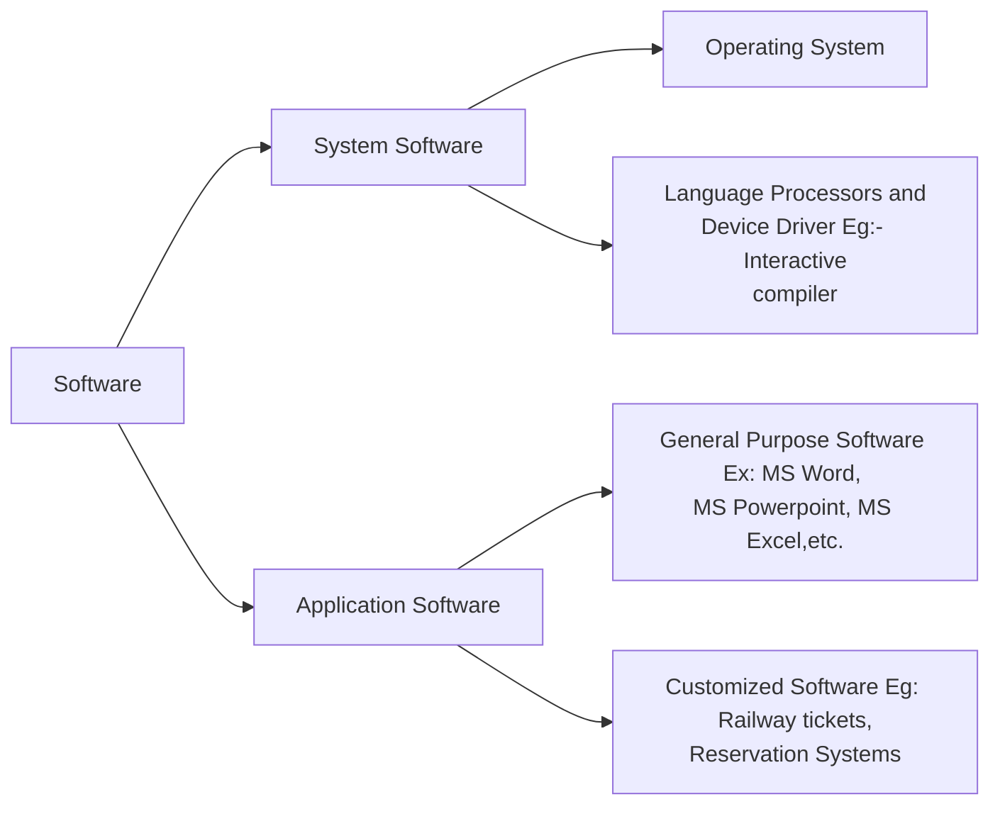

# Software

Software is a collection of instructions or commands computer program that is used to run machine and carry out any function. It is computer program that provides set of instruction to execute computer commands.

## System Software
It is software that directly operates the computer hardware and provides the basic functionality to the user as well as to other softwares to operate smoothly. It basically controls computers interfunctioning and also control hardware device such as monitor, printer, etc. It is an interface between hardware and user application.

### Features of System Software

1. **Speed:** It is optimized for rapid operation to provide an efficient platform for higher-level software.

2. **Complexity:** System software is generally more challenging to manipulate due to its lower-level nature and close interaction with hardware components.

3. **Language:** System software is written in low-level languages so the CPU or other hardware can understand it.

4. **Small in size:** The size of software is small compared to all other applications.

5. **Close to the system:** It is directly connected to the hardware and enables them to run.

### Types of System Software

#### Operatiing System
It is a main program of computer system when the computer system is on. It is the first software that leads into Computer memory. Basically it manages Computer memory, CPU, printer, all the resources.
_Example_: Windows, Linux, Mac OS, etc.

#### Language Processor
It consist of human readable language into a machine language and vice-a-versa. It converts program written in high level languages such as Java, C, CPP, Python, etc. into set of instructions that are easily readable by machine source code.

#### Device Driver
It is a program or software that controls and have that device. Every device like printer, Mouse and modem needs a driver to connect with computer system externally.

## Application Software

### Features of Application Software

1. **User-friendly Interface:** Application software is designed to be user-friendly & intuitive, making it easy for users to navigate & perform tasks.

2. **Customization:** Many applications allow users to customize settings & other options to meet their specific needs.

3. **Data Analysis:** Many applications include data analytics tools, such as spreadsheets or business intelligence tools.

4. **Productivity tools:** Many application software programs include tools that help users to be more productive, such as calendars or task managers, etc.

5. **Data storage & retrieval:** Application software is often used to store & retrieve important data such as contacts, documents & other information.

### Types of Application Software

#### General Purpose
They are used for variety of task and it is not limited to specific tasks. 
_Example_: MS Office

#### Utility Software
It is used to support the computer infrastructure. It is designed to analyse, configure, optimise and maintain the system.
_Example_: Antivirus, Disk Manager

#### Customized Software
It is used or design to perform specific task for function for specific organisation. Example: Airline Ticket Reservation.

## Difference between System & Application Software

| Feature                         | System Software                                           | Application Software                                       |
|---------------------------------|-----------------------------------------------------------|------------------------------------------------------------|
| **Purpose**                     | Manages and controls hardware components and provides a platform for running application software. | Helps users perform specific tasks like word processing, browsing, or gaming. |
| **Examples**                    | Operating Systems (Windows, macOS, Linux), Device Drivers, BIOS | Word Processors (MS Word), Web Browsers (Chrome, Firefox), Games |
| **Dependency**                  | Works independently of application software; necessary for running application software. | Depends on system software to function and cannot run without it. |
| **Installation**                | Usually comes pre-installed with the device or is installed during system setup. | Installed by the user based on need, either from a physical medium or via download. |
| **Interaction with Hardware**   | Directly interacts with hardware components to manage resources like CPU, memory, and storage. | Indirectly interacts with hardware via system software for task execution. |
| **Resource Management**         | Handles resource management, including memory allocation, process scheduling, and device management. | Utilizes resources provided by the system software to execute specific tasks. |
| **User Interaction**            | Typically runs in the background with minimal direct user interaction; provides an interface for running applications. | Directly interacts with the user through GUIs (Graphical User Interfaces) for task completion. |

