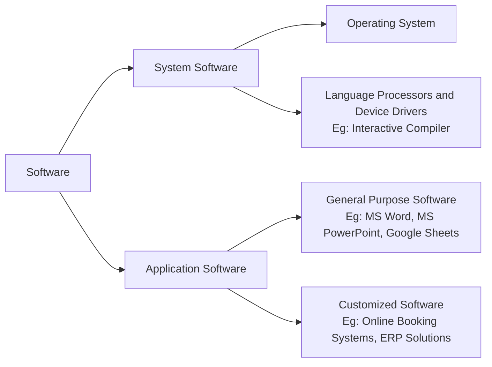

+++
date = '2025-01-11T10:37:47+05:30'
draft = false
title = 'Understanding Software'
math = true
+++

# Understanding Software: A Modern Perspective

Software refers to a collection of instructions, programs, or commands that enable a computer to perform specific tasks. It bridges the gap between users and the hardware, facilitating seamless execution of various functions.

## System Software

System software is foundational and interacts directly with computer hardware. It acts as an intermediary between hardware and user applications, ensuring smooth operation of the computer.

### Features of System Software

1. **Efficiency:** Optimized for high-speed operation and resource management.
2. **Hardware Interaction:** Facilitates direct communication between hardware components and software.
3. **Low-level Languages:** Written in low-level programming languages like Assembly or C for hardware compatibility.
4. **Compact Size:** Typically smaller in size compared to application software.
5. **Integral Role:** Essential for hardware functionality and system operation.

### Types of System Software

#### 1. **Operating System (OS)**
The core software that manages hardware resources and provides services for other software.  
_Examples_: Windows 11, macOS Sonoma, Ubuntu 23.04.

#### 2. **Language Processors**
Convert high-level programming languages (like Python, JavaScript, or Rust) into machine-readable code.  
_Examples_: Compilers, Interpreters, Assemblers.

#### 3. **Device Drivers**
Specialized software that enables communication between hardware and the operating system.  
_Examples_: Printer drivers, GPU drivers (like NVIDIA, AMD).

---

## Application Software

Application software is designed to perform specific tasks for users, ranging from productivity tools to entertainment applications.

### Features of Application Software

1. **User-Centric Design:** Offers intuitive and user-friendly interfaces.
2. **Customizability:** Allows personalization to suit individual or organizational needs.
3. **Data Analytics:** Includes advanced tools for processing and analyzing data.
4. **Productivity Enhancements:** Features tools for task management, scheduling, and collaboration.
5. **Cloud Integration:** Leverages cloud technology for data storage, sharing, and real-time collaboration.

### Types of Application Software

#### 1. **General Purpose Software**
Used for a variety of everyday tasks.  
_Examples_: Google Workspace, Microsoft Office 365.

#### 2. **Utility Software**
Supports system maintenance and optimization.  
_Examples_: Antivirus software (like Norton, Avast), Disk Cleaners.

#### 3. **Customized Software**
Tailored for specific business requirements.  
_Examples_: E-commerce platforms, Customer Relationship Management (CRM) systems.

---

## Difference Between System and Application Software

| Feature                         | System Software                                           | Application Software                                       |
|---------------------------------|-----------------------------------------------------------|------------------------------------------------------------|
| **Purpose**                     | Manages hardware and provides a platform for applications. | Helps users perform specific tasks or activities.          |
| **Examples**                    | Operating Systems (Windows, Linux), BIOS, Drivers         | Browsers (Chrome, Edge), Office Tools, Games               |
| **Dependency**                  | Operates independently and is mandatory for the system.   | Requires system software to function.                      |
| **Installation**                | Pre-installed or added during setup.                     | Installed by users based on requirements.                  |
| **Interaction with Hardware**   | Direct interaction to manage resources.                  | Indirectly accesses hardware via system software.          |
| **Resource Management**         | Handles resource allocation and process management.       | Utilizes resources provided by system software.            |
| **User Interaction**            | Minimal user interaction, runs in the background.         | Directly interacts with users through GUIs.                |

---

## Modern Applications in the Tech Ecosystem

- **System Software Trends:** Adoption of lightweight and secure OS solutions like Linux distros for IoT (e.g., Ubuntu Core).
- **Application Software Advancements:** Increasing use of AI-powered tools like ChatGPT and Microsoft Copilot to enhance productivity.
- **Cloud Integration:** Growth in SaaS (Software as a Service) platforms enabling cross-device usability.
- **Device Drivers Evolution:** Drivers optimized for AI hardware like Tensor Processing Units (TPUs).

By understanding the fundamentals of software and its evolution, we can better appreciate its role in modern technological advancements.

